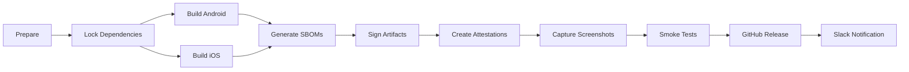

# Release Train Documentation

## Overview
This document describes the automated release train process for verifd, including reproducible builds, SBOM generation, artifact signing, and attestation.

## Release Workflow

### Triggering a Release
Releases are triggered manually via GitHub Actions:

1. Navigate to Actions → Release Train workflow
2. Click "Run workflow"
3. Provide inputs:
   - **Version**: Semantic version (e.g., 1.2.3)
   - **Candidate**: RC number (default: 1)
   - **Environment**: staging or production

Example: Version `1.2.3`, RC `2` → Tag: `v1.2.3-rc2`

### Release Pipeline Stages



## Build Process

### 1. Dependency Locking
- Creates immutable pnpm-lock snapshot
- Generates SHA256 hash for verification
- Stores as `pnpm-lock-${VERSION}.yaml`
- All builds use this exact snapshot

### 2. Platform Builds

#### Android APK
```bash
# Built with locked dependencies
./gradlew assembleRelease \
  -PversionName="1.2.3" \
  -PversionCode=${BUILD_NUMBER}

# Signed with production keystore
jarsigner -sigalg SHA256withRSA \
  -digestalg SHA-256 \
  app-release.apk

# Aligned for optimization
zipalign -v 4 app-release.apk verifd-v1.2.3-rc2.apk
```

#### iOS IPA
```bash
# Archive with Xcode
xcodebuild archive \
  -workspace verifd.xcworkspace \
  -scheme verifd \
  -configuration Release \
  MARKETING_VERSION="1.2.3"

# Export IPA
xcodebuild -exportArchive \
  -archivePath verifd.xcarchive \
  -exportOptionsPlist ExportOptions.plist
```

### 3. SBOM Generation
CycloneDX format SBOMs generated for both platforms:
- `sbom-android-${VERSION}.json`
- `sbom-ios-${VERSION}.json`
- `sbom-combined-${VERSION}.json`

### 4. Artifact Signing
All artifacts include:
- SHA256 checksums
- SHA512 checksums
- GPG signatures (via GitHub)

### 5. Attestations
- **Provenance**: Build environment and inputs
- **SLSA**: Supply chain attestation
- **GitHub**: Native attestation API

## Release Artifacts

### Directory Structure
```
release-v1.2.3-rc2/
├── verifd-v1.2.3-rc2.apk
├── verifd-v1.2.3-rc2.apk.sha256
├── verifd-v1.2.3-rc2.apk.sha512
├── verifd-v1.2.3-rc2.ipa
├── verifd-v1.2.3-rc2.ipa.sha256
├── verifd-v1.2.3-rc2.ipa.sha512
├── sbom-combined-v1.2.3-rc2.json
├── RELEASE_NOTES.md
└── smoke-test-checklist.md
```

### Verification
```bash
# Verify Android APK
sha256sum -c verifd-v1.2.3-rc2.apk.sha256

# Verify iOS IPA
shasum -a 256 -c verifd-v1.2.3-rc2.ipa.sha256

# Verify SBOM
cyclonedx validate sbom-combined-v1.2.3-rc2.json
```

## Screenshot Automation

### Captured Screens
1. **Home Screen**: App launch state
2. **Verify Screen**: Form interface
3. **Success Screen**: vPass granted UI

### Platforms
- **iOS**: iPhone 15 Pro simulator
- **Android**: Pixel 7 Pro emulator

Screenshots stored as:
- `screenshots/ios/home-${VERSION}.png`
- `screenshots/android/verify-${VERSION}.png`

## Smoke Test Checklist

Automated checklist generation includes:

### Android
- [ ] APK installs successfully
- [ ] App launches without crash
- [ ] Verify flow completes
- [ ] vPass grants successfully
- [ ] Call screening works
- [ ] Post-call sheet appears

### iOS
- [ ] IPA installs via TestFlight
- [ ] App launches without crash
- [ ] Verify flow completes
- [ ] vPass grants successfully
- [ ] Call Directory updates
- [ ] Shortcuts integration works

### Backend
- [ ] Health check passes
- [ ] Metrics endpoint responds
- [ ] Rate limiting enforced
- [ ] CORS headers correct

### Security
- [ ] Config signatures valid
- [ ] Device auth working
- [ ] Privacy telemetry enabled
- [ ] No PII in logs

## GitHub Release

### Release Contents
- Draft release created automatically
- Pre-release flag set
- All artifacts attached
- Release notes included
- Checksums listed

### Manual Steps
1. Review draft release
2. Verify all artifacts present
3. Test download links
4. Remove draft status
5. Publish release

## Slack Notifications

Release completion triggers Slack notification with:
- Version and RC number
- Target environment
- Build ID
- Artifact checklist
- Direct links to:
  - GitHub release
  - Action run artifacts

## Rollback Procedure

If release issues detected:

### 1. Immediate Rollback
```bash
# Revert to previous release
git checkout v1.2.2
git tag v1.2.3-rollback
git push origin v1.2.3-rollback

# Trigger new build from stable tag
gh workflow run release-train.yml \
  -f version=1.2.2 \
  -f candidate=rollback \
  -f deploy_env=production
```

### 2. Investigation
- Download failed release artifacts
- Check build logs
- Verify dependency lock
- Review SBOM for issues
- Test locally with same lock file

### 3. Fix Forward
- Create hotfix branch
- Apply minimal fix
- Test with production lock
- Release as patch version

## Security Considerations

### Build Environment
- GitHub-hosted runners only
- No persistent state
- Clean environment each run
- Secrets never logged

### Artifact Security
- Signed with GitHub keys
- Checksums for verification
- SLSA attestations
- Provenance tracking

### Supply Chain
- Dependency locking
- SBOM generation
- No dynamic dependencies
- Reproducible builds

## Monitoring

### Key Metrics
- Build duration
- Artifact sizes
- SBOM component count
- Test pass rate

### Alerts
- Build failure → Slack
- Missing artifacts → PagerDuty
- Signature failure → Security team
- SBOM validation error → Engineering

## Troubleshooting

### Build Failures

#### Dependency Lock Issues
```bash
# Verify lock file
sha256sum pnpm-lock.yaml

# Compare with snapshot
diff pnpm-lock.yaml .release/pnpm-lock-v1.2.3-rc2.yaml

# Force refresh
pnpm install --frozen-lockfile --force
```

#### Android Build Errors
```bash
# Clear gradle cache
./gradlew clean

# Check SDK versions
sdkmanager --list

# Verify keystore
keytool -list -keystore signing.keystore
```

#### iOS Build Errors
```bash
# Clear derived data
rm -rf ~/Library/Developer/Xcode/DerivedData

# Update pods
cd apps/ios && pod install --repo-update

# Check provisioning
security find-identity -p codesigning
```

### Artifact Issues

#### Missing Checksums
```bash
# Regenerate locally
sha256sum verifd-v1.2.3-rc2.apk > verifd-v1.2.3-rc2.apk.sha256
sha512sum verifd-v1.2.3-rc2.apk > verifd-v1.2.3-rc2.apk.sha512
```

#### SBOM Validation
```bash
# Validate format
npm install -g @cyclonedx/cli
cyclonedx validate sbom-android-v1.2.3-rc2.json

# Check components
jq '.components | length' sbom-combined-v1.2.3-rc2.json
```

### Screenshot Failures

#### Simulator Issues
```bash
# Reset iOS simulator
xcrun simctl erase all

# Reset Android emulator
emulator -avd Pixel_7_Pro -wipe-data
```

## Release Schedule

### Regular Releases
- **Weekly**: Staging releases (Wednesdays)
- **Biweekly**: Production releases (every other Friday)
- **Monthly**: Security updates (first Tuesday)

### Emergency Releases
- Triggered on-demand
- Skip screenshot capture
- Minimal smoke tests
- Immediate Slack alert

## Compliance

### SOC2 Requirements
- [x] Reproducible builds
- [x] Dependency locking
- [x] Artifact signing
- [x] Audit trail (GitHub)
- [x] Change management

### App Store Requirements
- [x] Privacy manifest
- [x] Screenshot automation
- [x] Version tracking
- [x] TestFlight integration

## Appendix

### Environment Variables
```bash
# Required secrets
ANDROID_KEYSTORE_BASE64
ANDROID_KEY_ALIAS
ANDROID_KEY_PASSWORD
APPLE_TEAM_ID
IOS_EXPORT_OPTIONS_BASE64
RELEASE_SLACK_WEBHOOK

# Optional
GITHUB_TOKEN (auto-provided)
ATTESTATION_KEY
```

### Version Numbering
```
MAJOR.MINOR.PATCH-rcN
1.2.3-rc1  → First release candidate
1.2.3-rc2  → Second release candidate
1.2.3      → Final release (tag only)
```

### File Naming Convention
```
verifd-v${VERSION}.${EXTENSION}
verifd-v1.2.3-rc2.apk
verifd-v1.2.3-rc2.ipa
sbom-${PLATFORM}-v${VERSION}.json
```

### Useful Commands
```bash
# List all release tags
git tag -l "v*"

# Download release artifacts
gh release download v1.2.3-rc2

# Verify attestation
gh attestation verify verifd-v1.2.3-rc2.apk \
  --owner verifd \
  --repo verifd

# Check workflow runs
gh run list --workflow=release-train.yml
```

## Support

For release train issues:
- Slack: #releases channel
- On-call: Use PagerDuty
- Documentation: This file + GitHub Actions logs
- Escalation: Platform team lead